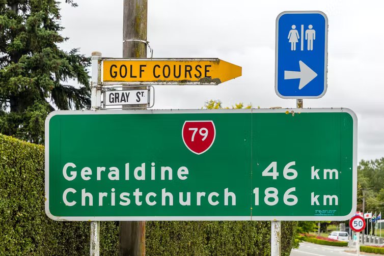
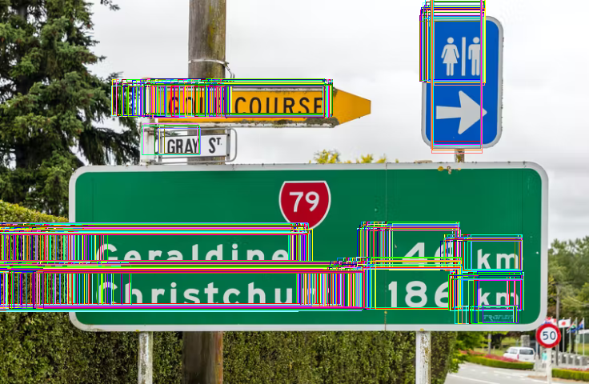
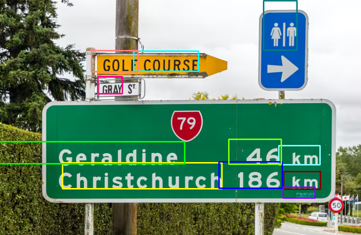

## README

C++ 版の[実践OpenCV 3 for C++](https://www.cutt.co.jp/book/978-4-87783-380-0.html)（2017年刊）の7.6節では、Neumann & Matesのアルゴリズムを用いて文字位置検出（localization）を行いました。しかし、Pythonインタフェースが提供されていなかったため、[実践OpenCV 4 for Python](https://www.cutt.co.jp/book/978-4-87783-460-9.html)（2021年刊）では割愛しました。そうこうするうちに、EAST（Efficient and Accuracy Scene Text detection pipeline）というモデルが利用可能になったので、ここに代打として紹介します。

スクリプト`test_east.py`は、あらかじめ用意されたモデル＋重みを収容した`frozen_east_text_detection.pb`を用いて、文字位置を検出します。

コマンドライン引数にファイルを指定して実行すると、実行状況をコンソールに表示し、ウィンドウを表示します。最初の画像は、モデルが検出したすべての矩形領域で、続く画像はNon-Maxima Suppressionで重なる領域を統合したあとの矩形領域です。

```
C:\temp>python test_east.py ..\..\Images\orig.png
Image resized from (503, 754, 3) to (480, 736, 3)               # 画像リサイズ（32の倍数）
Blob shape: (1, 3, 480, 736)                                    # blob化後のシェイプ
Shapes: scores (1, 1, 120, 184), geometries (1, 5, 120, 184)    # スコアとジオメトリのシェイプ
809 rectangles.                                                 # 検出された矩形領域の数
Shape: boxes: (11, 4)                                           # NMS語の矩形領域の数。
```

入力画像、モデル検出の矩形、NMS後の矩形を次に示します。

</img>
</img>
</img>

うーん、左側と上に余計なスペースがあるのが多いなぁ。


### References

- Zhou, Yao, Wen, Wang, Zhou, He and Liang: [EAST: An Efficient and Accurate Scene Text Detector](https://arxiv.org/abs/1704.03155), CVPR 2017 - 原著論文。
- OpenCV: [opencv/samples/dnn/text_detection.cpp](https://github.com/opencv/opencv/blob/master/samples/dnn/text_detection.cpp) - OpenCVのオリジナルのC++サンプル。
- timgates42: [imutils](https://github.com/PyImageSearch/imutils) - Non-maxima Suppression（NMS）の関数がある。
- Pystyle: [OpenCV – 物体検出で使われる Non Maximum Suppression について](https://pystyle.info/opencv-non-maximum-suppression/) - NMSのとてもよい説明。

