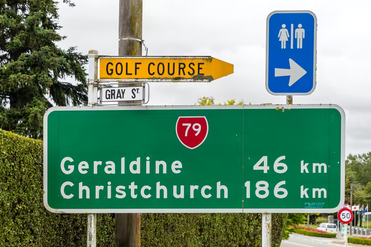

<a href="./README.jp.md"></img></a> 日本語版READMEはこちら

## README

In the previous version (in Section 7.6, [実践OpenCV 3 for C++](https://www.cutt.co.jp/book/978-4-87783-380-0.html)), I demonstrated Neumann & Mates text localization algorithm. Unfortunately, the lib comes from C++ contrib, so I did not include it in the Python book. Lately, I found EAST（Efficient and Accuracy Scene Text detection pipeline）along with resuable model and trained data. So, here I go.

The script `test_east.py` uses the pre-prepared `frozen_east_text_detection.pb` and detects the regions of the text in a given image.

Specify the file name in the command line and run. It reports a number of information while it processes the image as shown below.

```
C:\temp>python test_east.py ..\..\Images\orig.png
Image resized from (503, 754, 3) to (480, 736, 3)               # Image is resized because model accepts only the size multiple of 32.
Blob shape: (1, 3, 480, 736)                                    # Shape after converted to blob
Shapes: scores (1, 1, 120, 184), geometries (1, 5, 120, 184)    # Shapes of scores and geometries from Net.forward()
809 rectangles.                                                 # A number of detected regions
Shape: boxes: (11, 4)                                           # Shape after NMS (Non-Maxima Suppression)
```

The script first shows the regions before NMS. After hitting any key, it then shows the rectangles after NMS. Sample imput image, detected regions (bare) and nms-ed regions are shown below:

</img>
</img>
</img>


### References

- Zhou, Yao, Wen, Wang, Zhou, He and Liang: [EAST: An Efficient and Accurate Scene Text Detector](https://arxiv.org/abs/1704.03155), CVPR 2017 - 原著論文。
- OpenCV: [opencv/samples/dnn/text_detection.cpp](https://github.com/opencv/opencv/blob/master/samples/dnn/text_detection.cpp) - OpenCVのオリジナルのC++サンプル。
- timgates42: [imutils](https://github.com/PyImageSearch/imutils) - Non-maxima Suppression（NMS）の関数がある。
- Pystyle: [OpenCV – 物体検出で使われる Non Maximum Suppression について](https://pystyle.info/opencv-non-maximum-suppression/) - NMSのとてもよい説明。

