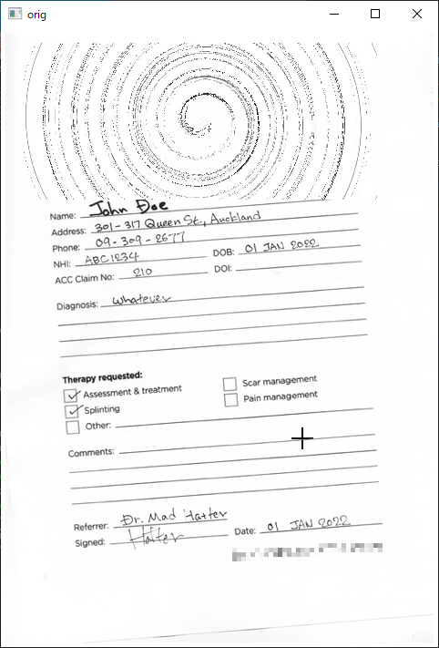
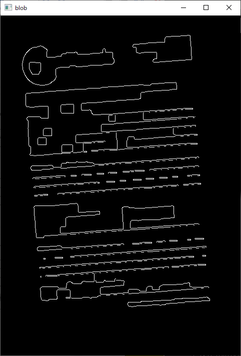
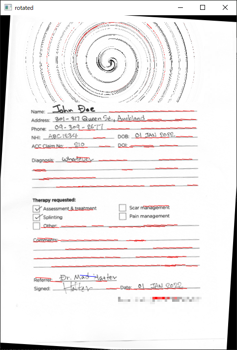

## README

`hough.py`は、ハフ変換（`cv2.HoughLinesP()`）を使って斜めにスキャンされた記入書類から水平線を探し、それに合わせて書類をまっすぐに直します。

ハフ変換は[実践OpenCV 2.4 for Pythonー映像処理&解析](https://www.cutt.co.jp/book/978-4-87783-346-6.html)（2014）の1.3.3節でさわりだけ示しましたが、実際には説明していませんでした（ので、改定版では第1章からも省かれた）。そこで、ここに登場させた次第です。

ハフ変換の前に、入力画像には次の手段で前処理を施します。

- カラー変換（BGRからグレースケールへ; `cv2.cvtColor()`)
- ピラミッド処理でのダウンサンプリングとアップサンプリングを介したノイズ除去（`cv2.pyrDown()`と`cv2.pyrUp()`）
- 2値化（`cv2.threhold()`）
- モーフィング（closing処理）によるノイズ除去（`cv2.morphologyEx()`）
- Cannyエッジ検出（`cv2.Canny()`）

画像ファイルをコマンドライン引数に指定することで実行します。スクリプトはコンソール（コマンドプロンプト）に検出した水平線の本数と平均角度（単位は度）を出力します（ちなみに、ハフ変換は縦横無関係に線を検出するので、そのうち20度以上の傾きのものは除外しています。つまり、20度以上傾けてスキャンされた画像では、このままでは動作しません。26行目を変更してください）。

```
C:\temp>python hough.py ..\..\Images\test.png
Found 88 horizontal lines. -3.462 ± 1.191 deg
```

ウィンドウは3枚表示されます。入力画像、前処理済み（blob）の画像、そして回転済みの画像です。回転済み画像には検出された水平線が赤で示されます。

スクリプトを終了するにはウィンドウ上で何でもよいのでキーを入力します。

 &nbsp;
 &nbsp;


このディレクトリには[my_util.py](./my_util.py)というファイルがあります。これは、前処理や回転を扱う関数を集めたものです。
