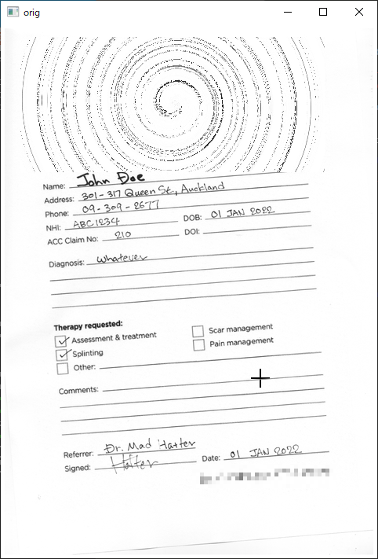
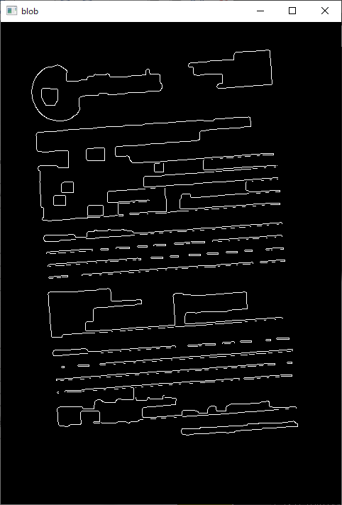
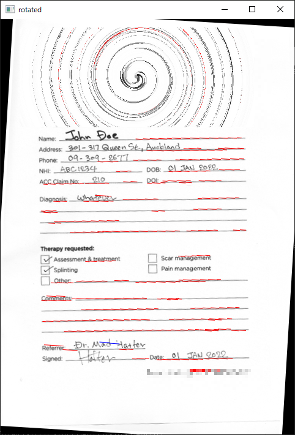

<a href="./README.jp.md"></img></a> 日本語版READMEはこちら

## README

`hough.py` is designed to straighten a scanned form (document). It uses the Hough transformation (`cv2.HoughLinesP()`) to detect the horizontal lines. The image is preprocessed as follows:

- Color conversion (BGR to gray; `cv2.cvtColor()`)
- Pyramid down and up for noise reduction (`cv2.pyrDown()` and `cv2.pyrUp()`)
- Binarization (`cv2.threhold()`)
- Morphing (closing) for additional noise reduction (`cv2.morphologyEx()`)
- Canny edge detection (`cv2.Canny()`)

`cv2.HoughLinesP()` detects any lines irrespective of the directions. The scripts filters the lines that are angled 20 degree (measured from the horizontal axes) or more. The '20 degree' was chosen ad-hoc: You may need to tweak Line 26.

Run the script with the target file. On the console (command prompt), you will see the number of detected horizontal lines and its average (along with the standard deviation) in degree (not radian).

```
C:\temp>python hough.py ..\..\Images\test.png
Found 88 horizontal lines. -3.462 ± 1.191 deg
```

Three images are displayed: Original input, blob (the image after preprocessing) and the one rotated. On the rotated image, the red lines show positive, the blue lines show negative lines respectively.

Hit any key to quit.

 &nbsp;
 &nbsp;


The directry also hosts a file named [my_util.py](./my_util.py). This is an assortment of utlity functions for preprocessing (blob generation), line drawing, and rotation. Some functions are not used in `hough.py`.

