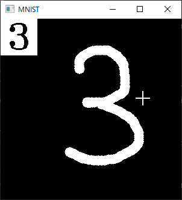

## README

[実践OpenCV 4 for Python 画像映像情報処理と機械学習](https://www.cutt.co.jp/book/978-4-87783-460-9.html)の付録E.2「手書き数字推定モデル」に掲載したTensorflow/Kerasスクリプトの改訂版です。出版時にTensorflow 2.3.1対応であったものを、APIの変更に伴い改定しました。2.9.1で動作確認しています。

手書き数字の訓練およびテストには、[NIST](https://www.nist.gov/srd/nist-special-database-19)（National Institute of Standards and Technology）のデータセットを用います。


### ファイル

`E_2_1.py`および`E_2_2.py`は書籍掲載のものを改訂したものです。それ以外は新規です。

#### [E_2_1.py](./E_2_1.py)

スクリプトはニューラルネットワークモデルを構築し、ダウンロードしたMNIST（Modified NIST）の手書きデータを用いて訓練をし、結果（モデルの構造と重み）をファイルに保存します。

[tf.keras.datasets.mnist.load_data()](https://www.tensorflow.org/api_docs/python/tf/keras/datasets/mnist/load_data)でダウンロードされたMNISTのデータは、`~/.keras/mnist.npz`に保存されます。ファイルはNumpyのzipファイルなので、[np.load()](https://numpy.org/doc/1.22/reference/generated/numpy.load.html)で読み込めます。ファイルには60,000個の訓練データと10,000個のテストデータが収容されています。個々の数字画像のサイズは28x28です。詳細は[THE MNIST DATABASE of handwritten digits](http://yann.lecun.com/exdb/mnist/)を参照してください。


モデルには[tensorflow.keras.Sequential()](https://www.tensorflow.org/api_docs/python/tf/keras/Sequential)を用いています。レイヤは次の通りです（スクリプト内の[tf.keras.Model.summary()](https://www.tensorflow.org/api_docs/python/tf/keras/Model)が出力した結果を手で整形しています）。

```
Model: "sequential"
_________________________________________________________________
 Layer (type)                  Output Shape              Param #
=================================================================
 conv2d (Conv2D)               (None, 26, 26, 32)        320
 conv2d_1 (Conv2D)             (None, 24, 24, 64)        18496
 max_pooling2d (MaxPooling2D)  (None, 12, 12, 64)        0
 dropout (Dropout)             (None, 12, 12, 64)        0
 flatten (Flatten)             (None, 9216)              0
 dense (Dense)                 (None, 128)               1179776
 dropout_1 (Dropout)           (None, 128)               0
 dense_1 (Dense)               (None, 10)                1290
=================================================================
Total params: 1,199,882
Trainable params: 1,199,882
Non-trainable params: 0
```

[tf.keras.Model.fit()](https://www.tensorflow.org/api_docs/python/tf/keras/Model)のEpochs（繰り返し回数）を10にしているので、訓練にはかなりの時間がかかります。早くないマシンを利用しているのなら、この値を下げて用います。

生成されたモデルおよび重みデータは`mnist_model_v2`ディレクトリに収容されます。詳細はKerasドキュメントの[Serialization and saving](https://keras.io/guides/serialization_and_saving/)を参照してください。

#### [E_2_2.py](./E_2_2.py)

`E_2_1.py`で生成したモデルと重みを用いて、実際に手書き数字を認識します。

数字は、左ボタンを押下しながら動かすことで300x300のウィンドウにマウス描画します。描き終えたら`Enter`を押下します。手書きから推定された数字が、下図のようにウィンドウの左上に表示されます。推定結果とその確率は、コンソール（コマンドプロンプト）にも表示されます。`ESC`でウィンドウはクリアできます。`Q`で終了です。

</img>

```
C:\temp>python E_2_2.py
Loaded.
Found 1. Probability 0.9986
Found 3. Probability 1.0000
```

#### [nist_data.py](./nist_data.py)

NISTの手書き数字データセット`mnist.npz`を読んでばらすスクリプトです。28x28の画像データと対応する数値を収容した行列を単に読んでいるだけなので、これ単体はとくにニューラルネットワークとは関係ありません。メイン部分はファイルに収容されている4つの行列（訓練用とテスト用の2つそれぞれに画像と対応数値があるので計4つ）のシェイプを表示し、ランダムに10個選んだ画像（とても小さいです）を表示するだけです。

```
C:\temp>python nist_data.py
x_test: (10000, 28, 28)                                  # 28x28の画像が10,000個
x_train: (60000, 28, 28)                                 # 28x28の画像が60,000個
y_train: (60000,)                                        # 数値60,000個
y_test: (10000,)                                         # 数値10,000個
```

#### [eval_model.py](./eval_model.py)

`E_2_1.py`で生成したモデルの精度を、NISTの10,000個のテストデータ（`x_train`と`y_train`）からチェックします。マシンの性能にもよりますが、筆者の環境では7分ほどかかりました（ヒット率は98.9%）。

```
C:\temp>python eval_model.py
Model loaded.
NNIST test data loaded.
..................................................................................
..................  Completed in 425.687 seconds. 42.569 samples/ms.
Tested with 10000 samples. Hit rate: 0.989.
```

#### [test_model.py](./test_model.py)

こちらもモデルの検証用です。`eval_model.py`とおなじくNISTのテストデータを使いますが、ランダムに1つずつ、実際の画像を表示しながらテストしていきます。任意のキーを押せば、次の（ランダムな）画像をチェックします。`ESC`で終了です。

```
C:\temp>python test_model.py
DNN model loaded.
Image data loaded.
Test started. Press ESC to quit. Any other key to continue.
Index: 6499. The answer: 2 >> Predicted: 2, p=1.000.
Index: 9849. The answer: 2 >> Predicted: 2, p=1.000.
Index: 3690. The answer: 6 >> Predicted: 6, p=1.000.
Index: 7304. The answer: 5 >> Predicted: 5, p=1.000.
Index: 8951. The answer: 0 >> Predicted: 0, p=1.000.
Done
```

#### [to_categorical.py](./to_categorical.py)

これは[tf.keras.utils.to_categorical()](https://www.tensorflow.org/api_docs/python/tf/keras/utils/to_categorical)の挙動を調べるための本人の練習用です。使い道はありません。
